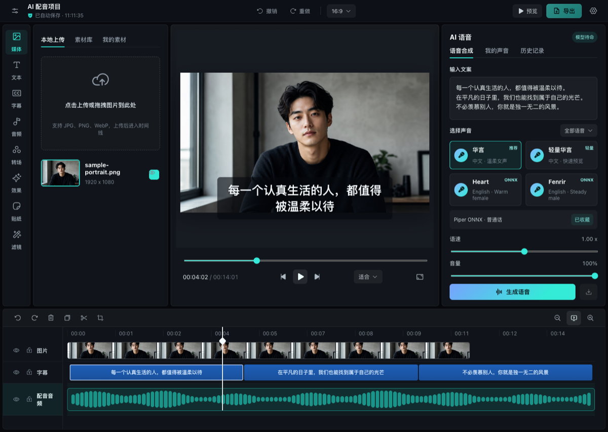

# Timeline Studio — 브라우저 AI 동영상 편집기

[English](README.md) | [中文](README.zh-CN.md) | [日本語](README.ja.md) | **한국어** | [Español](README.es.md) | [Français](README.fr.md) | [Deutsch](README.de.md) | [Português](README.pt-BR.md) | [ไทย](README.th.md) | [Tiếng Việt](README.vi.md) | [Русский](README.ru.md)

[](https://skills.sh/MartinDelophy/ai-video-editor)
[](CONTRIBUTING.md) [](https://linux.do)

## 딥 신세시스 기술의 책임 있는 사용

이 도구는 딥 신세시스 기술을 기반으로 하며 기술 연구와 학습 목적으로만 제공됩니다.

사용자는 다음 사항을 반드시 준수해야 합니다.

- 본인 또는 적법한 사용 허가를 받은 사람의 얼굴 이미지나 동영상만 사용할 것
- 불법적이거나 권리를 침해하거나 허위 또는 오해를 유발하는 콘텐츠를 제작하거나 배포하지 않을 것
- 생성된 콘텐츠를 실제 영상으로 가장하지 않고, 당사자의 동의 없이 다른 사람의 신원을 도용하지 않을 것

위 요구 사항을 위반하여 발생하는 모든 법적 책임은 사용자 본인에게 있습니다.

## 프로젝트 업데이트

- **2026년 8월 28일 — Chrome 내장 모델 실시간 다운로드 진행률:** 자동 편집에서 화면 이해 모델과 자막 번역 모델의 실제 Chrome 진행률, 완료 상태, 시도 횟수를 각각 표시합니다. Chrome이 45초 동안 진행률을 보내지 않으면 정체 상태와 사용자 클릭이 필요한 다운로드 재시도 동작을 표시하여, 필요한 사용자 활성화를 유지하면서 Chrome의 부분 다운로드 상태를 재사용합니다.
- **2026년 8월 27일 — 타임라인 정밀 편집:** 비디오 원본 범위를 지키는 슬립, 양쪽 이웃 클립을 동기화해 트리밍하는 3클립 슬라이드, 방향키로 프레임 단위 롤링 조정이 가능한 편집점 선택을 추가했습니다. 모든 모드는 메인 영상의 빈틈 없는 연결, 트랙 잠금, 원본 경계를 유지하고 실시간 드래그 피드백과 11개 언어 현지화를 제공합니다. 세로 및 9:16 타임라인 썸네일은 중앙 채움 자르기를 사용해 검은 여백 없이 셀을 채웁니다.
- **2026년 8월 26일 — 잠금 인식 리플 편집:** 타임라인 도구 모음에 명시적인 리플 모드를 추가했습니다. 미디어를 메인 트랙 위로 드래그하면 미디어 길이만큼 삽입 공간이 열리고 뒤쪽 클립과 전환 지점이 놓기 전부터 함께 이동합니다. 메인 영상에는 앞쪽 롤링 경계 핸들이 추가되었고, 화면 속 화면 드롭은 대상 행에서 실제 위치와 미디어 길이로 자리를 미리 표시합니다. 메인 영상 삽입, 복제, 삭제 및 길이 변경 시 대상 시간 지정 클립을 동일한 시간 차이만큼 이동하고, 활성 자막·오디오 연결을 유지하며, 연결된 원본 오디오는 영상 시퀀스에서 계산하고, 잠긴 트랙은 이동하지 않습니다.
- **2026년 8월 26일 — 이식 가능한 영상 분할:** Agent `visual.split`을 수정하여 연속된 왼쪽·오른쪽 클립이 다시 열어도 같은 보관 소스 미디어를 유지하고, 브라우저 내보내기에서 전체 영상과 내장 원본 오디오가 보존되도록 했습니다.
- **2026년 8월 24일 — 리듬 클릭 물결:** 결정론적 무작위 히트 위치, 박자표와 4분음표 BPM, 히트마다 전체 화면으로 퍼지는 하나의 굴절 물결, 흑백에서 컬러로의 동기화 전파, 오른쪽 설정 패널, 동일한 미리보기와 내보내기, 11개 언어 현지화를 갖춘 편집 가능한 osu! 스타일 효과를 추가했습니다.

계획된 작업은 [Roadmap](ROADMAP.md), 출시된 변경 사항은 [Releases](https://github.com/MartinDelophy/ai-video-editor/releases), 개별 작업과 버그는 [Issues](https://github.com/MartinDelophy/ai-video-editor/issues)에서 확인하세요.

## 무엇을 만들 수 있나요?

재현 가능한 전후 비교 예시와 편집 레시피를 살펴보세요:

→ [AI Video Editing Skills Handbook](https://github.com/MartinDelophy/timeline-studio-handbook)

<p align="center">
  <a href="https://trendshift.io/repositories/77422?utm_source=trendshift-badge&amp;utm_medium=badge&amp;utm_campaign=badge-trendshift-77422" target="_blank" rel="noopener noreferrer"></a>
  <a href="https://trendshift.io/repositories/77422?utm_source=trendshift-badge&amp;utm_medium=badge&amp;utm_campaign=badge-trendshift-77422" target="_blank" rel="noopener noreferrer"></a>
</p>

Timeline Studio는 브라우저에서 실행되는 로컬 우선 AI 동영상 편집기입니다. CapCut 스타일의 멀티트랙 타임라인에 AI 음성, 자동 자막, 비전 도구, 말하는 아바타, 결정적 오프라인 내보내기를 결합합니다.

[편집기 열기](https://video-editor.ai-creator.top/) · [데모 보기](https://www.youtube.com/watch?v=chdRPG2ndMs) · [Hugging Face Space](https://huggingface.co/spaces/haixin/timeline-studio)



## 주요 기능

- Piper/VITS ONNX와 Kokoro 82M을 이용한 다국어 음성.
- Stable Audio 3 Small Q4 ONNX와 WebGPU를 이용한 로컬 AI 음악 생성. 자유 형식 프롬프트 번역, 30/60/90/120초 옵션, 파형 기반 장시간 루프, 영구 모델 캐시, 내 에셋 자동 추가를 지원합니다.
- Whisper small q8 ONNX 자동 자막.
- YOLOS tiny와 MODNet 스마트 프레이밍.
- 보컬 분리 및 JoyVASA/LivePortrait 아바타 생성.
- 오버레이, 마스크, 필터, 애니메이션, 키프레임을 지원하는 멀티트랙 편집.
- WebCodecs와 오디오 믹싱을 이용한 브라우저 MP4/WebM 내보내기.
- 설치형 PWA, 로컬 모델 캐시, `.timeline` 프로젝트.

## AI 음성 데모

https://github.com/user-attachments/assets/304a744e-d620-4380-9c17-19af3726f5a4

## Agent Skill

이 저장소에는 편집 가능한 동영상 타임라인을 계획하고 조작하며 검증하는 [`edit-timeline-studio`](skills/edit-timeline-studio/SKILL.md) Agent Skill이 포함되어 있습니다. GitHub CLI 2.90.0 이상에서 설치할 수 있습니다.

[skills.sh](https://skills.sh/MartinDelophy/ai-video-editor)를 통한 설치에는 Node.js 22.20.0 이상이 필요합니다.

```bash
npx skills add MartinDelophy/ai-video-editor --skill edit-timeline-studio
```

```bash
# Claude Code
gh skill install MartinDelophy/ai-video-editor edit-timeline-studio --agent claude-code --scope user

# Codex
gh skill install MartinDelophy/ai-video-editor edit-timeline-studio --agent codex --scope user
```

검증된 릴리스로 고정하려면 `--pin v1.0.0`을 추가하세요. 설치 전에 `gh skill preview MartinDelophy/ai-video-editor edit-timeline-studio`로 내용을 확인할 수 있습니다.

## 로드맵

- **현재:** 결정적 오프라인 내보내기 안정화, 타임라인 편집 신뢰성 향상, 브라우저 E2E 테스트 확대.
- **다음:** 에이전트 기반 편집을 위한 버전 관리형 헤드리스 명령 실행기와 공유하기 쉬운 재사용 프로젝트 템플릿.
- **향후:** 협업 검토 흐름, 플러그인 확장 인터페이스, 로컬에서 검증된 AI 모델 추가.

우선순위는 [GitHub Discussions](https://github.com/MartinDelophy/ai-video-editor/discussions)에서 함께 정합니다.

## 도움을 기다립니다

브라우저 미디어, WebCodecs, WebGPU/ONNX, 타임라인 UX, 현지화, 테스트 및 문서화 기여를 환영합니다. 재현 가능한 버그는 [Issues](https://github.com/MartinDelophy/ai-video-editor/issues)에, 아이디어와 작품은 [Discussions](https://github.com/MartinDelophy/ai-video-editor/discussions)에 공유해 주세요. 작은 수정, 테스트, 번역, 예제도 큰 도움이 됩니다.

## 빠른 시작

Node.js 20+와 최신 Chromium 브라우저가 필요합니다. WebGPU를 권장합니다.

```bash
git clone https://github.com/MartinDelophy/ai-video-editor.git
cd ai-video-editor
npm install
npm run dev
```

## 검증

```bash
npm run build
npm run check
```

## 지원 및 피드백

이 프로젝트가 도움이 되었다면 ⭐ Star를 눌러 주세요. 문제가 발생하면 [Issue를 등록해 주세요](https://github.com/MartinDelophy/ai-video-editor/issues).

질문과 피드백을 공유하고 다른 사용자 및 기여자와 소통하려면 [Discord 커뮤니티](https://discord.gg/uq2uvUTBr)에 참여해 주세요.

## 라이선스

[MIT](LICENSE)
