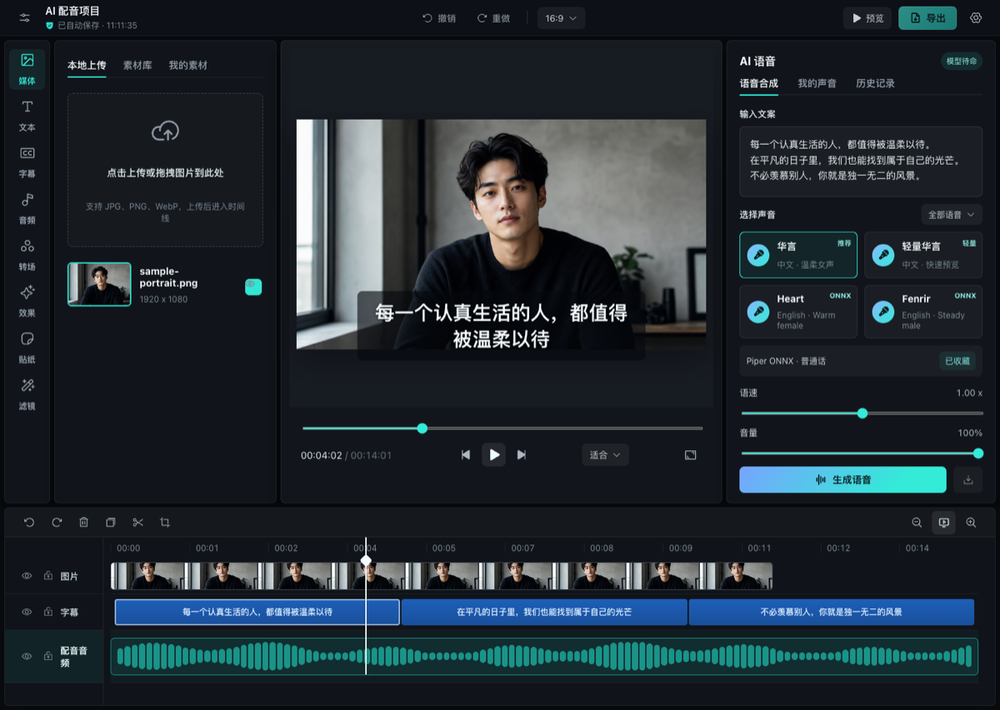

# Timeline Studio — Trình chỉnh sửa video AI trên trình duyệt

[English](README.md) | [中文](README.zh-CN.md) | [日本語](README.ja.md) | [한국어](README.ko.md) | [Español](README.es.md) | [Français](README.fr.md) | [Deutsch](README.de.md) | [Português](README.pt-BR.md) | [ไทย](README.th.md) | **Tiếng Việt** | [Русский](README.ru.md)

[](https://skills.sh/MartinDelophy/ai-video-editor)
[](CONTRIBUTING.md) [](https://linux.do)

## Sử dụng công nghệ tổng hợp sâu có trách nhiệm

Công cụ này sử dụng công nghệ tổng hợp sâu và chỉ dành cho mục đích nghiên cứu kỹ thuật và học tập.

Người dùng phải bảo đảm rằng:

- chỉ sử dụng hình ảnh hoặc video khuôn mặt của chính mình, hoặc của người đã cấp phép hợp pháp;
- không tạo hoặc phát tán nội dung bất hợp pháp, xâm phạm quyền, sai sự thật hoặc gây hiểu lầm;
- không trình bày nội dung được tạo ra như hình ảnh có thật và không mạo danh người khác khi chưa có sự đồng ý.

Người dùng tự chịu mọi trách nhiệm pháp lý phát sinh từ việc vi phạm các yêu cầu này.

## Cập nhật dự án

- **2026-10-04** — Bản đồ độ sâu — Chuyển video thành độ sâu xám: gần sáng, xa tối. Phân tích độ sâu giải mã khung hình đồng thời với suy luận, mã hóa PNG trong Worker và giảm tần suất cập nhật giao diện. Xem trước và xuất bản đồ độ sâu nội suy giữa các mẫu, sửa thời gian nguồn khi cắt và đổi tốc độ, đồng thời tái sử dụng ảnh đã giải mã. Đã lưu video độ sâu vào Tài nguyên của tôi. Video độ sâu thay thế clip nguồn và giữ các tài nguyên. Thời lượng phát lấy từ chuỗi hình ảnh, sửa lỗi hiện 0 giây sau khi xóa rồi chèn lại video. Video độ sâu có âm thanh nguồn khớp với cắt và đổi tốc độ; video gốc cùng âm thanh vẫn được giữ.
- **2026-10-04** — Anna bổ sung công cụ và Skill để kiểm tra, xem trước và tạo bản sao .timeline đã chỉnh sửa. Gói native đầu tiên hỗ trợ macOS Apple Silicon; chỉnh sửa trực tiếp vẫn là luồng riêng. Anna bỏ các thẻ Sửa bằng AI và Âm thanh khỏi thuộc tính hình ảnh.
- **2026-10-03** — Video chính và video hình trong hình hỗ trợ âm lượng và hiệu ứng không gian cho từng đoạn mà không cần tách âm thanh. Cài đặt được lưu cùng dự án và áp dụng khi xem trước và xuất.
- **2026-10-02 — Anna tự áp dụng chỉnh sửa ChatCut đã hoàn tất, hỗ trợ hoàn tác và xem thay đổi trong hội thoại. Nhãn HOT xanh ngọc làm nổi bật tính năng; khi khôi phục, dự án hiển thị trước rồi bổ sung dạng sóng còn thiếu ở nền.**
- **2026-10-02 — ChatCut của Anna bổ sung biến đổi hình ảnh, bánh xe màu, glitch, rung theo nhịp và chuyển cảnh bên cạnh cắt, phụ đề và âm thanh. Có thể xem xét thay đổi trước khi áp dụng và hoàn tác.** Agent cũng xử lý phụ đề tự động và xóa hình mờ video, kiểm tra kết quả rồi chuẩn bị thêm phụ đề đúng thời gian hoặc thay clip để xem xét. Smart bổ sung xóa khoảng ngừng; ChatCut phát hiện cục bộ trong đoạn video đã chọn và tạo bản cắt hình tiếng đồng bộ để xem xét và hoàn tác.

Xem [Roadmap](ROADMAP.md) cho công việc dự kiến, [Releases](https://github.com/MartinDelophy/ai-video-editor/releases) cho thay đổi đã phát hành và [Issues](https://github.com/MartinDelophy/ai-video-editor/issues) cho nhiệm vụ và lỗi.

## Có thể tạo ra những gì?

Khám phá các ví dụ trước/sau có thể tái lập và công thức biên tập:

→ [AI Video Editing Skills Handbook](https://github.com/MartinDelophy/timeline-studio-handbook)

<p align="center">
  <a href="https://trendshift.io/repositories/77422?utm_source=trendshift-badge&amp;utm_medium=badge&amp;utm_campaign=badge-trendshift-77422" target="_blank" rel="noopener noreferrer"></a>
  <a href="https://trendshift.io/repositories/77422?utm_source=trendshift-badge&amp;utm_medium=badge&amp;utm_campaign=badge-trendshift-77422" target="_blank" rel="noopener noreferrer"></a>
</p>

Timeline Studio là trình chỉnh sửa video AI ưu tiên xử lý cục bộ và chạy trong trình duyệt. Ứng dụng kết hợp dòng thời gian nhiều rãnh kiểu CapCut với lồng tiếng AI, phụ đề tự động, công cụ thị giác, avatar biết nói và quy trình xuất ngoại tuyến xác định.

[Mở trình chỉnh sửa](https://video-editor.ai-creator.top/) · [Xem bản demo](https://www.youtube.com/watch?v=chdRPG2ndMs) · [Hugging Face Space](https://huggingface.co/spaces/haixin/timeline-studio)



## Tính năng chính

- Lồng tiếng đa ngôn ngữ với Piper/VITS ONNX và Kokoro 82M.
- Tạo nhạc AI cục bộ bằng Stable Audio 3 Small Q4 ONNX qua WebGPU, hỗ trợ dịch lời nhắc tự do, các lựa chọn 30/60/90/120 giây, lặp nhạc dài theo phân tích dạng sóng, bộ nhớ đệm mô hình bền vững và tự động thêm vào Tài nguyên của tôi.
- Phụ đề tự động bằng Whisper small q8 ONNX.
- Căn khung thông minh với YOLOS tiny và MODNet.
- Tách giọng hát/nhạc và tạo avatar bằng JoyVASA cùng LivePortrait.
- Chỉnh sửa nhiều rãnh với lớp phủ, mặt nạ, bộ lọc, hoạt ảnh và khung hình chính.
- Xuất MP4/WebM trong trình duyệt bằng WebCodecs và trộn âm thanh.
- PWA có thể cài đặt, bộ nhớ đệm mô hình cục bộ và dự án `.timeline`.

## Bản demo lồng tiếng AI

https://github.com/user-attachments/assets/304a744e-d620-4380-9c17-19af3726f5a4

## Agent Skill

Kho mã này bao gồm Agent Skill [`edit-timeline-studio`](skills/edit-timeline-studio/SKILL.md) để lập kế hoạch, thực hiện và xác minh các dòng thời gian video có thể tiếp tục chỉnh sửa. Cài đặt bằng GitHub CLI 2.90.0 trở lên.

Cài đặt qua [skills.sh](https://skills.sh/MartinDelophy/ai-video-editor) yêu cầu Node.js 22.20.0 trở lên.

```bash
npx skills add MartinDelophy/ai-video-editor --skill edit-timeline-studio
```

```bash
# Claude Code
gh skill install MartinDelophy/ai-video-editor edit-timeline-studio --agent claude-code --scope user

# Codex
gh skill install MartinDelophy/ai-video-editor edit-timeline-studio --agent codex --scope user
```

Thêm `--pin v1.0.8` để cài bản phát hành đã được kiểm chứng thay vì luôn theo bản mới nhất. Có thể xem trước nội dung bằng `gh skill preview MartinDelophy/ai-video-editor edit-timeline-studio`.

## Lộ trình

- **Hiện tại:** củng cố quy trình xuất ngoại tuyến xác định, tăng độ tin cậy của dòng thời gian và mở rộng kiểm thử đầu-cuối trong trình duyệt.
- **Tiếp theo:** mở rộng tính tương đương giữa kết xuất headless và trình duyệt, các lệnh WebMCP có thể xem xét và việc chia sẻ mẫu dự án.
- **Sau này:** bổ sung quy trình đánh giá cộng tác, giao diện tiện ích mở rộng và thêm các mô hình AI được xác minh cục bộ.

Các ưu tiên được thảo luận tại [GitHub Discussions](https://github.com/MartinDelophy/ai-video-editor/discussions).

## Cần sự đóng góp

Chúng tôi hoan nghênh đóng góp về phương tiện trong trình duyệt, WebCodecs, WebGPU/ONNX, UX dòng thời gian, bản địa hóa, kiểm thử và tài liệu. Hãy báo lỗi có thể tái hiện trong [Issues](https://github.com/MartinDelophy/ai-video-editor/issues), chia sẻ ý tưởng tại [Discussions](https://github.com/MartinDelophy/ai-video-editor/discussions), hoặc gửi các bản sửa lỗi, kiểm thử, bản dịch và ví dụ có phạm vi rõ ràng.

## Khởi động nhanh

Yêu cầu Node.js 20+ và trình duyệt Chromium hiện đại. Khuyến nghị WebGPU.

```bash
git clone https://github.com/MartinDelophy/ai-video-editor.git
cd ai-video-editor
npm install
npm run dev
```

## Kiểm tra

```bash
npm run build
npm run check
```

## Hỗ trợ và phản hồi

Nếu dự án này hữu ích với bạn, hãy cân nhắc tặng dự án một ⭐ Star. Nếu gặp vấn đề, vui lòng [mở một Issue](https://github.com/MartinDelophy/ai-video-editor/issues).

Hãy tham gia [cộng đồng Discord](https://discord.gg/uq2uvUTBr) để đặt câu hỏi, chia sẻ phản hồi và kết nối với những người dùng cũng như cộng tác viên khác.

## Giấy phép

[MIT](LICENSE)
