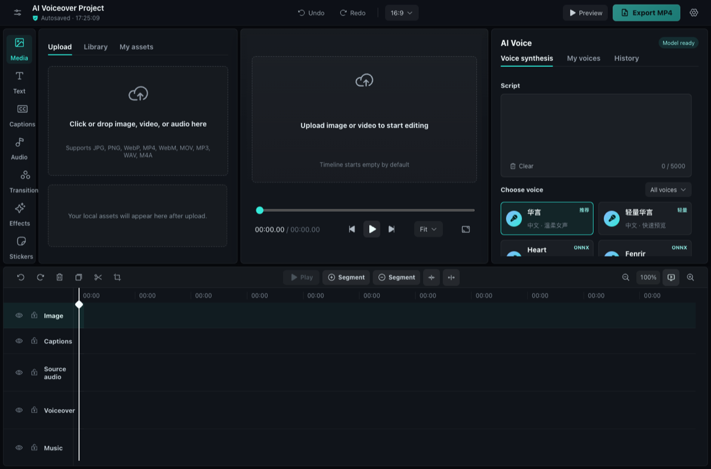
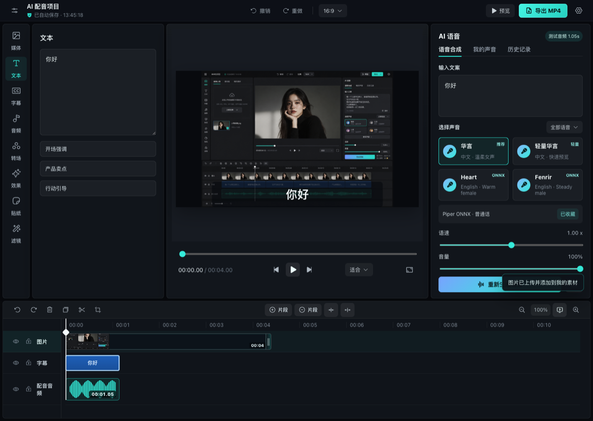

# ai-video-editor

语言：[English](README.md) | **中文**

一个浏览器优先的 AI 视频编辑器，支持图片/视频时间线、AI 配音、字幕、视频原声、背景音乐以及 MP4/WebM 导出。当前原型参考了 CapCut/剪映一类深色时间线编辑器，但重点放在 Web 端 AI 配音和轻量视频编辑流程。

## 界面截图

### 英文编辑工作台



### 时间线编辑与 AI 配音工作区


### 配音与字幕对齐



### 导出进度浮层


## 当前能力

- 本地上传图片、视频、音频素材。
- 素材库使用紧凑九宫格展示本地上传资源。
- 素材可从媒体库拖拽到匹配的时间线轨道。
- 图片/视频轨道支持多片段、拖拽排序、切分、删除和缩放时长。
- 无需先生成配音，也可以播放图片/视频时间线预览。
- 可根据输入文案生成 AI 配音。
- 可将生成音频、字幕和视觉片段在时间线上对齐。
- 字幕可拖动、隐藏、删除，并支持位置和字号调整。
- 上传视频后，可把视频原声分离到独立原声轨。
- 支持独立背景音乐轨。
- 支持多轨道控制：显示/隐藏、锁定、删除、复制、切分、缩放、磁吸和重排。
- 支持滤镜、视觉效果、贴纸和转场预设。
- 浏览器支持时导出 MP4，不支持时回退到 WebM。
- 本地渲染导出时显示导出进度。
- 首次语言选择会保存到 `localStorage`。

## AI 功能

当前 AI 能力尽量在浏览器端运行：

- 基于 ONNX/browser engine 的文本转语音。
- 中文配音方向：Piper/VITS browser ONNX 模型。
- 英文配音方向：Kokoro 82M ONNX。
- 轻量语音预览和生成历史恢复。
- 根据生成音频时长对齐文案字幕时间线。
- 浏览器录音，可手动录制旁白并写入配音轨。
- 本地解析配音、视频原声、背景音乐波形。

## 多语言界面

编辑器提供首次进入语言选择，并将选择保存到本地。

当前包含语言：

- 中文
- English
- 日本語
- 한국어
- Español
- Français
- Deutsch
- Português
- ไทย
- Tiếng Việt

语言选择首屏包含英文说明，方便非中文用户理解第一步操作。

## 后续 AI Roadmap

计划或值得支持的 AI 能力：

- 上传视频和录音的自动语音识别。
- 自动生成字幕和字幕翻译。
- 面向营销、教育、短视频、产品演示等场景的 AI 文案生成和改写。
- 声音克隆或自定义说话人适配，并提供明确授权和隐私控制。
- 多角色配音和对话生成。
- 旁白、字幕、图片和视觉节奏点的智能对齐。
- 上传视频的 AI 场景检测。
- 长视频自动高光提取。
- AI 背景音乐推荐和节拍匹配。
- 降噪、响度标准化和人声增强。
- 图片/视频增强、背景移除和主体分割。
- 在保留离线/本地优先模式的同时，支持云端辅助加载更大模型。
- 批量导出和基于模板的视频生成。

## 技术栈

- React 19
- Vite 6
- ONNX/browser TTS 相关依赖
- `@ffmpeg/ffmpeg` 浏览器端媒体处理支持
- Browser MediaRecorder/export pipeline
- Phosphor Icons
- Netlify 部署配置

## 项目结构

```text
src/
  App.jsx
  components/
    PreviewStage.jsx
    Timeline.jsx
    Topbar.jsx
    VoicePanel.jsx
    panels.jsx
    ui.jsx
  config/
    editor.js
  lib/
    media.js
    timeline.js
  i18n.js
  main.jsx
  styles.css
public/
  assets/
netlify.toml
```

## 本地开发

```bash
npm install
npm run dev
```

生产构建：

```bash
npm run build
```

预览生产构建：

```bash
npm run preview
```

## 部署

项目包含 Netlify 配置：

```bash
npm run build
npx netlify-cli deploy --prod --dir=dist
```

`netlify.toml` 定义了：

- 构建命令：`npm run build`
- 发布目录：`dist`
- SPA fallback redirect 到 `index.html`

## 仓库文件管理

以下内容会被刻意排除在 git 之外：

- `node_modules/`
- `dist/`
- `qa/`
- 本地下载、截图和生成的 QA 媒体文件
- `.netlify/`
- 本地 npm 缓存和机器相关配置
- 本地 Codex/agent 工作说明

## License

原型项目。公开生产使用前建议补充正式 License。
